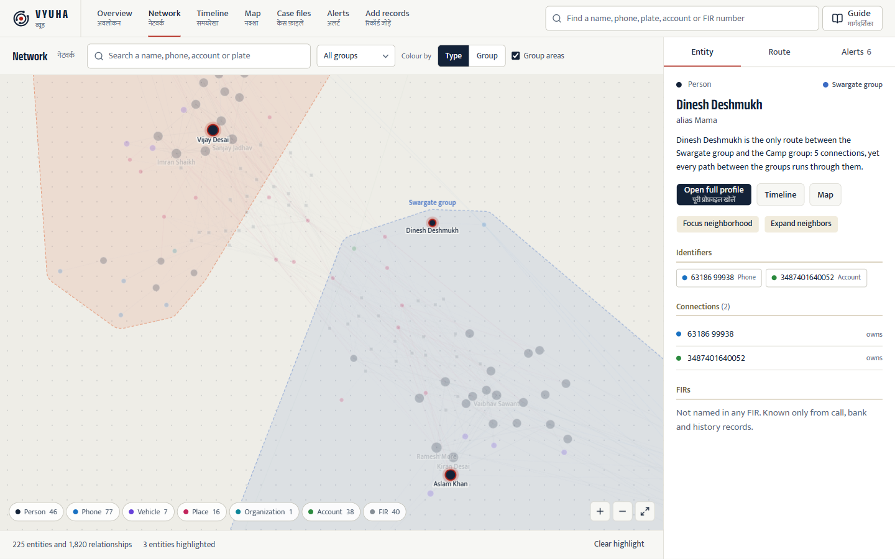
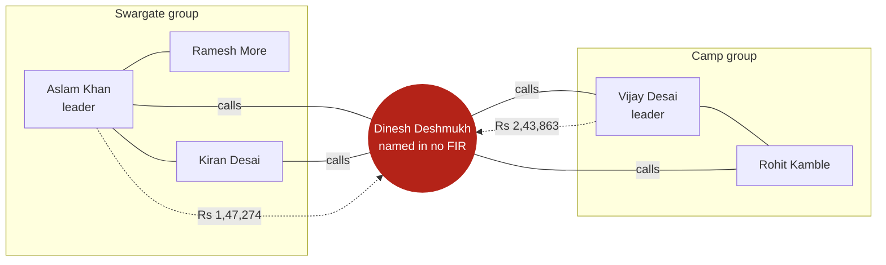
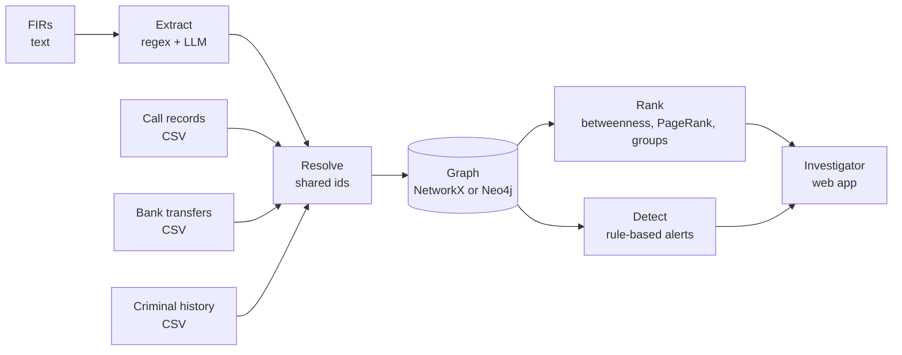
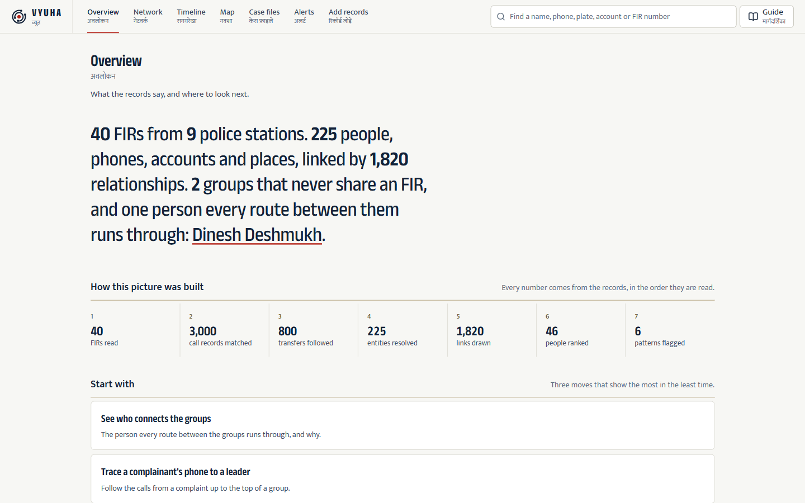
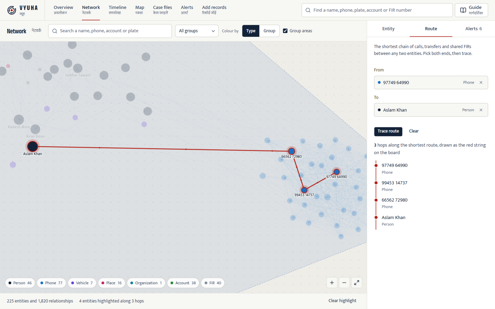
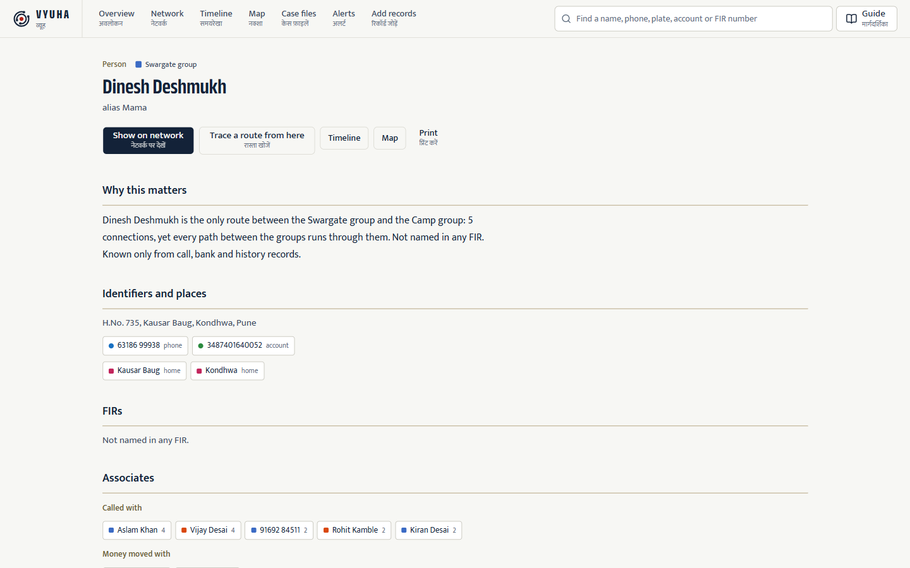
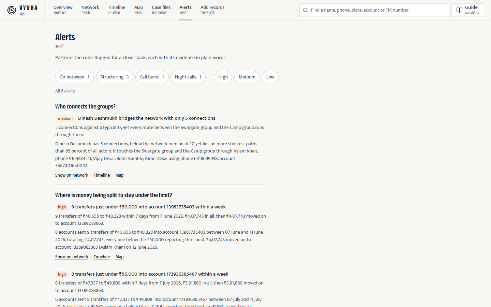
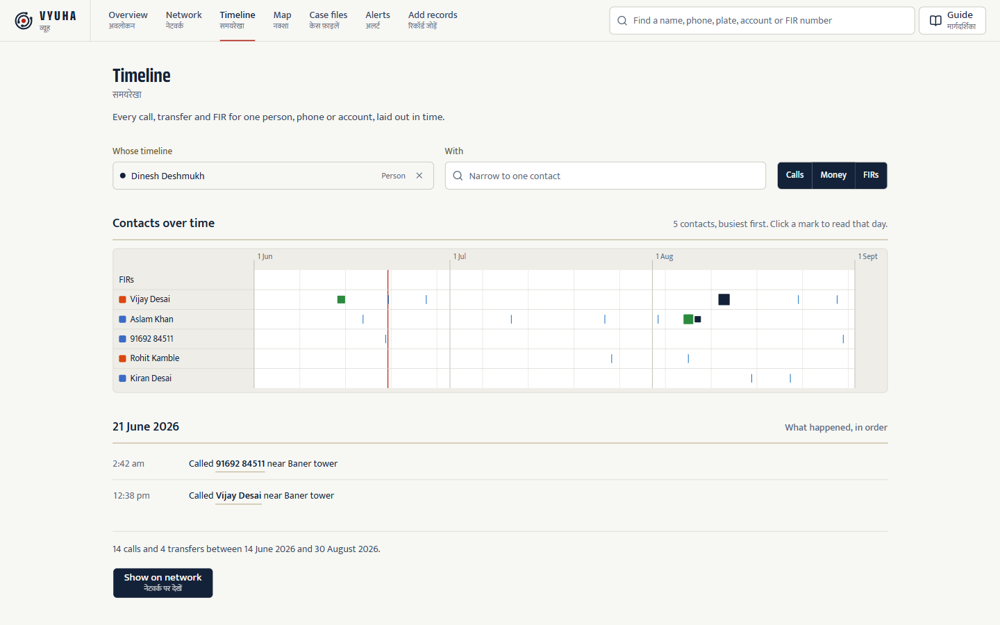
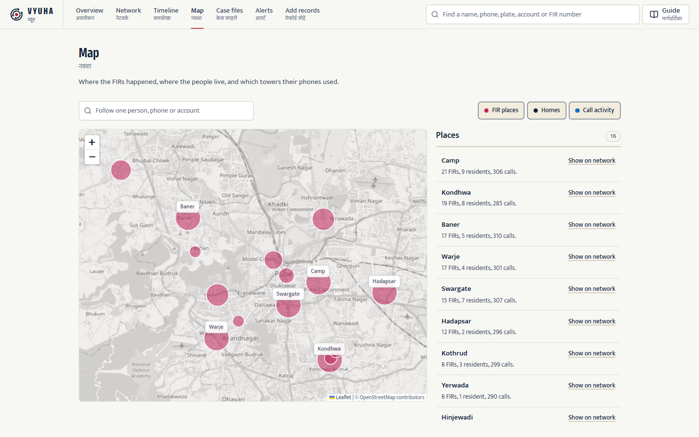
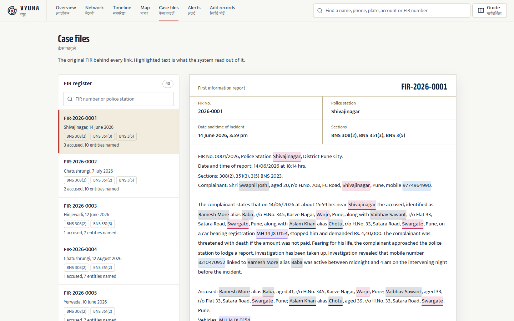

<p align="center">
  
</p>

<h1 align="center">VYUHA</h1>

<p align="center">
  <b>व्यूह</b> &nbsp;|&nbsp; AI-driven criminal network analysis for investigators
</p>

<p align="center">
  
  
  
  
  
  
</p>

Police already hold the answers, spread across FIRs, call records and bank statements. VYUHA reads them together, turns every person, phone, vehicle, account and place into one network, and shows the investigator who matters, how two suspects connect and what looks wrong.

Vyuha is Sanskrit for a battle formation, like the Chakravyuha of the Mahabharata: rings inside rings, arranged so that whoever sits at the centre is never reached. A criminal network is built the same way. VYUHA shows you the way in.



## What it does

| | |
|---|---|
| **Collects** | FIR text, call detail records, bank transfers and criminal history, uploaded as plain text and CSV |
| **Extracts** | People, phones, vehicles, accounts, places and organisations, with regular expressions for fixed formats and a language model for names and roles |
| **Links** | The same phone, account, plate or name in two files becomes one node, with no manual matching |
| **Ranks** | Key players by betweenness and PageRank, groups by Louvain communities, and the shortest route between any two entities |
| **Detects** | Call bursts, deposits split under the reporting limit, night-only phones and bridges between groups, each with its evidence in plain words |
| **Shows** | A network board, profiles, a timeline, a map of Pune and the original FIRs with every extracted entity marked, in English and Hindi |

## What it finds

The demo dataset is 40 synthetic FIRs from nine Pune police stations, about 3,000 call records and 800 bank transfers. Read one by one, the FIRs describe two unrelated gangs. Read together, they show one man who connects them and is never named in any FIR.



Counting contacts hides him: the gang leaders have more than 50 each and he has five. Betweenness, the share of shortest routes that pass through a person, puts him first, and the bridge alert points at him without any training data.

<p align="center">
  
</p>

The full story, with the money trail, the burner phone and the step-by-step demo script, is in [docs/demo.md](docs/demo.md).

## How it works



- **Shared identifiers, not a matching model.** Every source builds ids the same way (`phone:9876543210`, `person:vikram singh`), so a phone in an FIR, a call record and a history file is one node.
- **The language model is kept on a short leash.** It fills a fixed schema, anything it returns that is not in the source text is dropped, and responses are cached so the demo runs offline with no key.
- **Rules that quote their evidence.** Every alert states the amounts, hours and counts behind it, so an officer can check it and a court can be told why.
- **Free tiers only.** Gemini, Groq or NVIDIA for extraction, AuraDB Free for the graph, and none of them needs a payment card.

Why each choice was made, and how it compares with spreadsheets, relational databases, search and commercial suites: [docs/design.md](docs/design.md).

## Screens

| | |
|---|---|
|  **Overview.** The finding in one sentence, and how the picture was built. |  **Route.** Three hops from a complainant's phone to a gang leader, drawn as the red string. |
|  **Profile.** Why a person matters, their identifiers, FIRs and associates. |  **Alerts.** Each pattern with its evidence in plain words. |
|  **Timeline.** Calls, transfers and FIRs for one person, contact by contact. |  **Map.** FIR places, homes and cell towers across Pune. |
|  **Case file.** The original FIR with every extracted entity marked. | |

## Run it

Backend, with uv and Python 3.12. API docs open at http://localhost:8000/docs.

```bash
cd backend
uv sync
uv run uvicorn app.main:app --reload
```

Frontend, with Bun. Copy `frontend/.env.example` to `frontend/.env` and set `VITE_API_KEY` to the `API_KEY` in `backend/.env`, or set `VITE_USE_FIXTURE=true` to run on the committed demo records without the backend. The app opens at http://localhost:5173.

```bash
cd frontend
bun install
bun run dev
```

To start a fresh investigation or keep the workspace in Neo4j AuraDB, see [docs/new-investigation.md](docs/new-investigation.md).

## Documentation

- [docs/demo.md](docs/demo.md): the demo case and the presentation script
- [docs/design.md](docs/design.md): design decisions and alternatives
- [docs/new-investigation.md](docs/new-investigation.md): using VYUHA on a new case, and saving to Neo4j
- [IMPLEMENTATION_PLAN.md](IMPLEMENTATION_PLAN.md): the phased build plan
- [TASKS.md](TASKS.md): current status

---

<p align="center">
  Built by Team Nexwave for Smart India Hackathon 2026, problem statement SIH26189 from the National Crime Records Bureau.<br>
  All data in this repository is synthetic.
</p>
