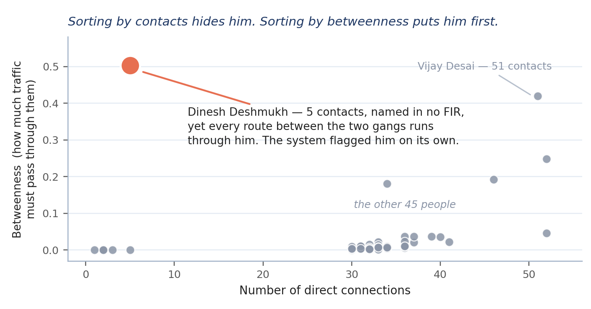

# The demo case

## Two gangs and the man between them

Everything below is synthetic and was generated with a fixed seed, but it is built the way a real investigation looks: 40 FIRs from nine Pune police stations between June and August 2026, about 3,000 call detail records and 800 bank transfers. Read separately, the FIRs are eight extortion cases, eight assaults, eight thefts, eight drug seizures and eight cyber frauds. Read together, they describe two gangs and the man who connects them.

The Warje gang, shown on the board as the Swargate group because groups are named after where most of their people live. Aslam Khan alias Chotu runs it from Swargate and drives the car MH 14 JX 0154 that appears in several complaints. His lieutenants are Ramesh More alias Baba and Kiran Desai alias Dada, both from Warje. Nine members do the street work: Sachin Patil, Vaibhav Sawant, Salman Khan, Prakash Jadhav, Ramesh Kulkarni, Sunil Thorat, Deepak Shinde, Ajay Deshmukh and Vaibhav Patil. Their extortion and assault cases cluster around Warje, Kothrud and Swargate.

The Kondhwa group, shown on the board as the Camp group. Vijay Desai alias Vicky leads it from Kondhwa with eight members: Rohit Kamble, Javed Ansari, Imran Shaikh, Tanveer Sayyed, Sanjay Jadhav, Santosh Kadam, Ravindra Chavan and Irfan Shaikh. Sanjay Jadhav is the most frequently named accused in the whole corpus, with nine FIRs. Their cases sit around Kondhwa, Hadapsar and Camp, and include the drug seizures and cyber frauds.

No FIR names members of both gangs. An investigator reading the register would see two unrelated sets of cases. The system finds what links them:

- The go-between. Dinesh Deshmukh alias Mama of Kondhwa is never named in any FIR. He exists only in the criminal history file, the call records and the bank statements. His phone 6318699938 talks to Aslam Khan, Kiran Desai, Vijay Desai and Rohit Kamble. His account 3487401640052 received Rs 1,47,274 from Aslam Khan's account and Rs 2,43,863 from Vijay Desai's account. With only five connections he is the only route between the two groups, which is why he has the highest betweenness score of anyone and why the bridge alert points at him.
- The money. Three mule accounts each collect eight or nine transfers of Rs 40,000 to Rs 49,999 inside a week, every one under the Rs 50,000 reporting threshold, then forward the whole sum. Two of them (Rs 4,07,743 on 12 June and Rs 3,91,880 on 12 July) pay into Aslam Khan's account 13389083863. The third (Rs 3,55,315 on 10 August) pays into Vijay Desai's account 1834738299737. Both gangs launder money the same way.
- The burner phone. FIR-2026-0001 mentions phone 8210470952 as linked to Ramesh More. The call records show all 15 of its calls fall between midnight and 4 am on the nights before incidents, to Aslam Khan, Deepak Shinde, Salman Khan and Prakash Jadhav.
- The call burst. Prakash Jadhav and Salman Khan exchanged 10 calls between 19:02 and 19:52 on 6 July 2026, the evening before an incident.
- The complainant's trail. Swapnil Joshi reported in FIR-2026-0001 that Ramesh More, Vaibhav Sawant and Aslam Khan stopped him in Shivajinagar and demanded Rs 4,40,000. His phone 9774964990 reaches Aslam Khan in three hops through the phones of Ajay Deshmukh and Aslam Khan himself, because the extortion calls are in the call records.

The live upload closes the story. backend/data/demo/FIR-2026-0041.txt is a new complaint from Swargate in which Kiran Desai of the Warje gang and Imran Shaikh of the Kondhwa group extort a shopkeeper together. It is the first document to name both gangs. After the upload the two of them rank as bridges beside Dinesh Deshmukh, and the network shows the gangs working as one.

## Presenting it

The seed network is committed, so the demo needs no network access and no LLM key. Open the Guide from the header: each step below is one of its tasks, and every page also has the Hindi line an officer expects.

1. Overview. Read the finding aloud: 40 FIRs from nine stations become 225 linked people, phones, accounts and places, two groups that never share an FIR, and one man whose phone talks to both. The strip underneath shows how the picture was built, in the order the records were read.
2. See who connects the groups. The board lights Dinesh Deshmukh in red between the two group areas while everything else fades, and the inspector says he is the only route between them and is not named in any FIR. Open full profile shows his phone, account, address, his associates on both sides and the money that moved through him, and prints as one sheet.
3. Trace a complainant's phone to a leader. The route from 97749 64990 to Aslam Khan is drawn as the red string: three hops from a complaint to the head of a group.
4. Follow the money. The Alerts page, filtered to structuring, reads each mule account in plain words: nine transfers just under Rs 50,000 in a week, then the whole sum moved on to the leader's account.
5. See when they talked. The timeline of Dinesh Deshmukh shows his calls to both groups on their own lanes with the money squares between them; click a mark to read that day.
6. See where it happened. The map shows the FIR places, homes and cell towers of Pune; follow one person to see only their places.
7. Read an FIR. FIR-2026-0001 opens as the sheet it was written on, with every extracted entity highlighted; click a name to open the profile.
8. Add a new FIR. Upload backend/data/demo/FIR-2026-0041.txt: four new entities appear and the key people now include Kiran Desai and Imran Shaikh as bridges.
9. Restore the demo records from the same page before the next run.
